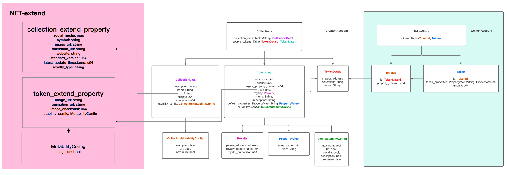

# NFT standard

The standard is an extension of the token contract in the Aptos framework to provide a richer ecosystem for Aptos NFT.
The extensions will be done in two parts, one is the collection, and the other is the token.



# Collections

The standard extension is based on [token.move](https://github.com/aptos-labs/aptos-core/blob/main/aptos-move/framework/aptos-token/sources/token.move) in aptos-token.
[token.move](https://github.com/aptos-labs/aptos-core/blob/main/aptos-move/framework/aptos-token/sources/token.move) defined the fields in the collection section as follows.

|Metadata	|Type	|Description	|
|---	|---	|---	|
|description	|string 	|Used to describe the collection	|
|name	|string 	|Collection name	|
|uri	|string 	|Used to locate additional information of this collection	|
|supply	|u64	|The total amount of token_data issued by the current collection	|
|maximum	|u64 	|The maximum number of token_data this collection can issue	|
|mutability_config	|Collection MutabilityConfig 	|Defines the mutability of description, uri, and maximum |

## extend_property

The extension standard will be implemented using a contract, and the extension properties defined in the contract can be located by URI. URI is described as nft://{contract_address}/{creator::collection}

|Metadata	|Type	|Description	|
|---	|---	|---	|
|social_media	|map 	|Describe the link to each social media account of the collection, e.g. twitter: twitter_url	|
|symbol	|string 	|Abbreviated descriptions of collections, such as ENS for Ethereum Name Service	|
|image_url	|string 	|Collection cover image link	|
|animation_url	|string 	|Collection of additional multimedia data links such as gif	|
|website	|string 	|Collection corresponding official website address	|
|standard_version	|u64	|The version number will be updated when the collection data is updated.	|
|commercial_standard	|string	|Used to describe the business protocol standards that collection adheres to, such as cc0, cc by	|
|update_block_height	|u64	|Record the block height of the last update of the collection, track the update time and compare the content before and after the update	|
|royalty_policy	|string 	|Describes  which royalty policy to follow, such as x2y2	|

# Token

## The Non-Fungible Standard

### extend_property

The extension standard will be implemented using a contract, and the extension properties defined in the contract will be located by URI. URI is described as nft://{contract_address}/{creator::collection::name}

|Metadata	|Type	|Description	|
|---	|---	|---	|
|image_url	|string	|Token image url	|
|animation_url	|string	|Token Additional multimedia data links, such as gif	|
|image_checksum	|u64	|For verifying the authenticity of the image using MD5 	|
|mutability_config	|bool 	|Describe whether the image can be changed	|
|update_block_height	|u64	|Record the block height of the last update of the token data, track the update time and compare the content before and after the update	|

### Token Metadata JSON URI

We are compatible with the [EIP-1155](https://eips.ethereum.org/EIPS/eip-1155#metadata) JSON schema, the client needs to implement the following URI to return token_metadata.
[https://token-cdn-domain/{creator}/{collection_name}/{token_name}.json](https://token-cdn-domain/%7Bcreator%7D/%7Bcollection_name%7D/%7Btoken_name%7D.json).
The reference is as follows.

```
{
    "title": "Token Metadata",
    "type": "object",
    "properties": {
        "name": {
            "type": "string",
            "description": "Identifies the asset to which this token represents"
        },
        "description": {
            "type": "string",
            "description": "Describes the asset to which this token represents"
        },
        "image": {
            "type": "string",
            "description": "A URI pointing to a resource with mime type image/* representing the asset to which this token represents. Consider making any images at a width between 320 and 1080 pixels and aspect ratio between 1.91:1 and 4:5 inclusive."
        },
        "properties": {
            "type": "object",
            "description": "Arbitrary properties. Values may be strings, numbers, objects or arrays."
        }
    }
}
```

The name and description are defined in TokenData at token.move, image is defined in token extend property described above, properties stored in token.move's token_properties in the Token structure, using the fixed "properties" as key, object serialized as string and stored in the corresponding value.
The returned JSON schema is shown in the following example.

```
`{
    "name": "Asset Name",
    "description": "Lorem ipsum...",
    "image": "https:\/\/s3.amazonaws.com\/your-bucket\/images\/{id}.png",
    "properties": {
        "simple_property": "example value",
        "rich_property": {
            "name": "Name",
            "value": "123",
            "display_value": "123 Example Value",
            "class": "emphasis",
            "css": {
                "color": "#ffffff",
                "font-weight": "bold",
                "text-decoration": "underline"
            }
        },
        "array_property": {
            "name": "Name",
            "value": [1,2,3,4],
            "class": "emphasis"
        }
    }
}`
```

## Reference

* <https://github.com/aptos-labs/aptos-core/blob/8b826d88b0f17255a753214ede48cbc44e484a97/ecosystem/web-wallet/src/core/types/TokenMetadata.ts>
* <https://github.com/aptos-labs/aptos-core/blob/main/aptos-move/framework/aptos-token/sources/token.move>
* <https://docs.metaplex.com/programs/token-metadata/token-standard#the-non-fungible-standard>
* <https://eips.ethereum.org/EIPS/eip-1155#metadata>

